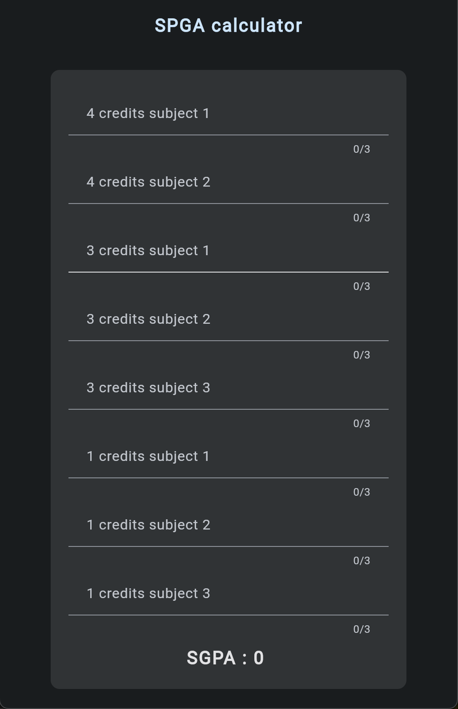

# SGPA Calculator

SGPA Calculator is a Flutter mobile application that helps students calculate their Semester Grade Point Average (SGPA) based on the marks obtained in different subjects.

## Features

- Calculate SGPA for a semester based on subject marks.
- Real-time SGPA updates as you fill in the marks.
- Support for 8 subjects with varying credit weightage:
  - 2 subjects of 4 credits each.
  - 3 subjects of 3 credits each.
  - 3 subjects of 1 credit each.

## Screenshots



## Getting Started

To get started with SGPA Calculator, follow these steps:

1. **Clone the Repository:**
   ```bash
   git clone https://github.com/chetanr250/SGPA-calculator.git
   ```

2. **Navigate to Project Directory:**
   ```bash
   cd SGPA-calculator
   ```

3. **Run the Application:**
   ```bash
   flutter run
   ```


